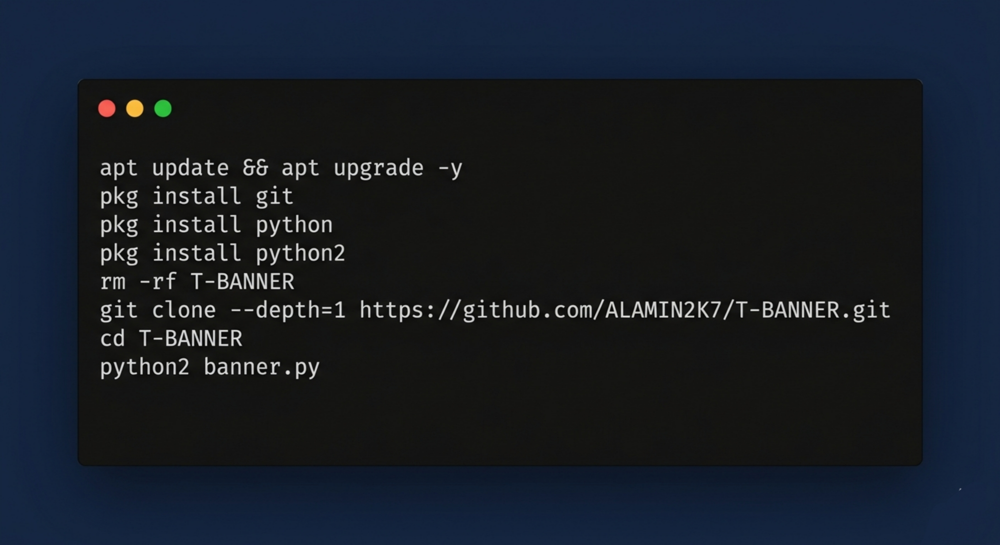

### 𝙏𝙀𝙍𝙈𝙐𝙓 𝙏𝘼𝙍𝙈𝙄𝙉𝘼𝙇 𝘽𝘼𝙉𝙉𝙀𝙍

Termux background stylish banner is a type of graphic design that is used to create attractive and eye-catching backgrounds for Termux Tarminal. It usually consists of a combination of colors, shapes, patterns,text  that match the theme and purpose of the banner.

### 𝙄𝙉𝙎𝙏𝘼𝙇𝙇 𝙏𝙊𝙊𝙇𝙎 𝙊𝙉 𝙏𝙀𝙍𝙈𝙐𝙓
````python
apt update && apt upgrade -y
pkg install git
pkg install python
pkg install python2
rm -rf T-BANNER 
git clone --depth=1 https://github.com/ALAMIN2K7/T-BANNER.git
cd T-BANNER
python2 banner.py
````
<p align="center">

## Preview >

<p align="center">
 

### 𝙏𝙤𝙤𝙡𝙨 𝙇𝙖𝙣𝙜𝙪𝙖𝙜𝙚
<p align="center">
  
</p>